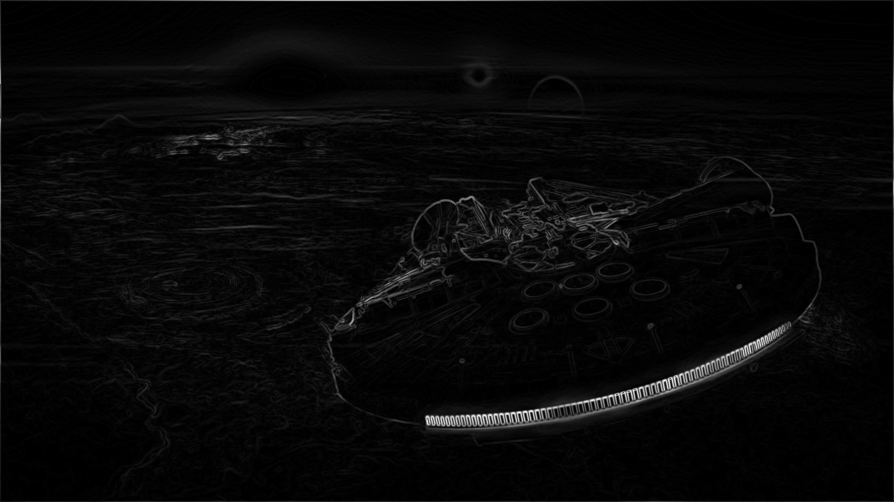

# Diceify
Diceify any image by translating all pixels to dice. The [Sobel operator](https://en.wikipedia.org/wiki/Sobel_operator) is used for edge detection. The edge information provides us with direction vectors dx and dy for every pixel which in turn determines the orientation of the dices.

## Edge detection

## Diceify

